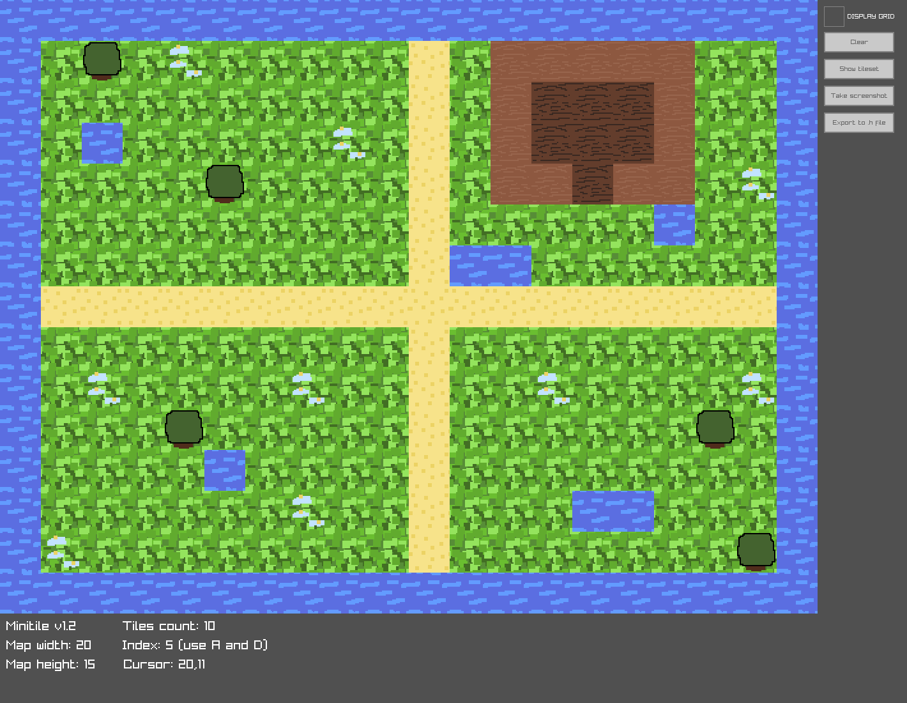
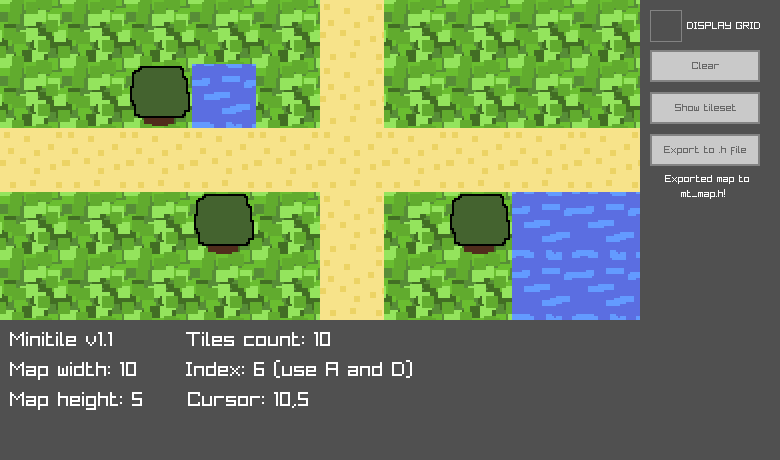

# minitile
A mini tilemap editor.



## Features
- Small: a compact editor great for prototyping maps
- Simple-to-use
- Export functionality: design your maps and export them to `.h` files!

## Usage
```
# Calling the program
./minitile [grid_width] [grid_height] [tile_size] [tileset_path]
Where [] are mandatory and () are optional.
Arguments help:
  [grid_width] - Width of the tilemap. Must be greater than 5 and lower than 20
  [grid_height] - Height of the tilemap. Must be greater than 5 and lower than 15
  [tile_size] - Size of each tile in the tileset. Must be greater than 8 and lower than 32.
                WARNING: the program will take this value both for x and y
  [tileset_path] - Path to tileset spritesheet

# Controls
Key A - Go back one in the tilesheet index
Key D - Go forward one in the tilesheet index
Left mouse button - Draw
Right mouse button - Erase
```

## Building
```
$ make
```
Windows is not available at the moment.
